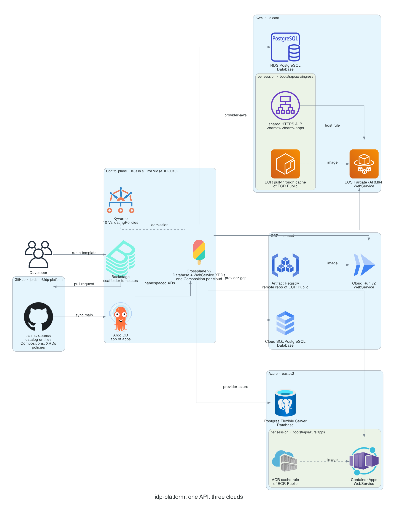
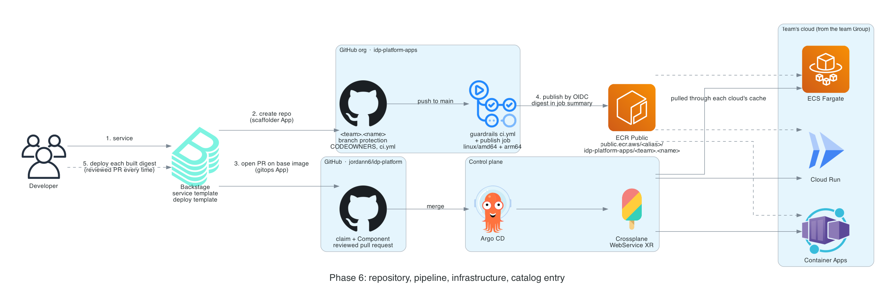
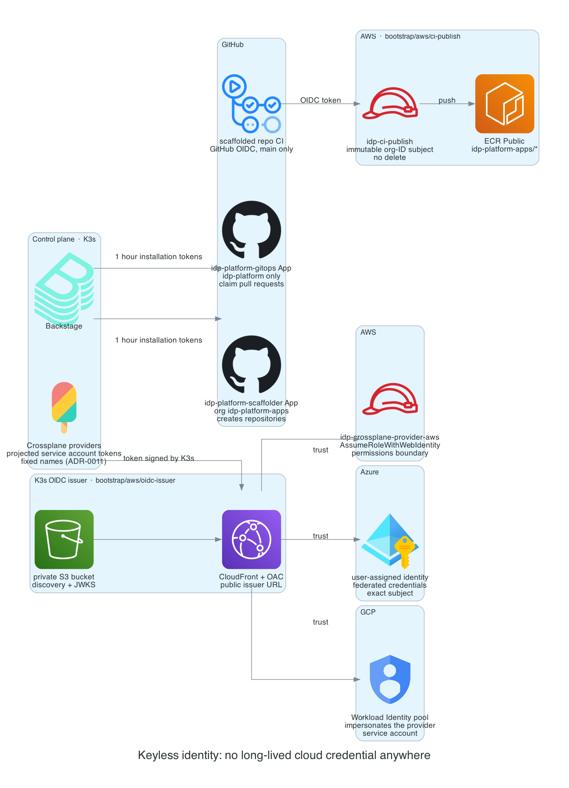

# idp-platform

One Internal Developer Platform over AWS, Azure, and GCP. A developer runs a Backstage template and gets a repository, a pipeline, cloud infrastructure, and a catalog entry, all through reviewed pull requests. One API sits on top of three clouds, with one control plane, and per-cloud Crossplane Compositions underneath. The cloud comes from the team, not from a form field, so the developer's experience is the same whichever cloud runs it.

Every design decision and every place the abstraction leaks is recorded in [DECISIONS.md](DECISIONS.md) (24 ADRs).

## Architecture



- **Control plane.** K3s in a Lima VM (ADR-0010) runs Backstage, Argo CD, Crossplane v2, and Kyverno. It is the platform brain, and it never runs inside one of the clouds it manages (ADR-0007).
- **Change path.** A Backstage template renders a claim and its catalog entity and opens a pull request on this repository. It never pushes. After review and an all-green CI, Argo CD syncs `claims/<team>/` from `main`, and Crossplane composes the cloud resources.
- **API.** Two cloud-agnostic types, `Database` and `WebService` (`platform.jordandesigns.io/v1alpha1`, namespaced XRs, ADR-0009). Each has one Composition per cloud, selected by the team's `platform.jordandesigns.io/cloud` label (ADR-0012).
- **Networking.** One private network per cloud, created in bootstrap. Claims never get their own VPC or NAT (ADR-0008, ADR-0014). Load balancers and Container Apps environments, the parts that bill by the hour, are per session modules, applied for a demo and destroyed after (ADR-0004, ADR-0022).
- **Images.** Every runtime pulls by digest through its own cache of ECR Public, with no registry credential anywhere.

### What a claim becomes

| Claim | AWS | GCP | Azure |
|---|---|---|---|
| `Database` | RDS PostgreSQL 17, private subnet group | Cloud SQL PostgreSQL 17, Private Service Access, `ENCRYPTED_ONLY` | Postgres Flexible Server, delegated subnet and private DNS zone |
| `WebService` | ECS Fargate (ARM64) behind a shared HTTPS ALB, `<name>.<team>.apps.jordandesigns.io` | Cloud Run v2 with its `run.app` URL, scale to zero | Container Apps on a shared environment, scale to zero |
| Image cache | ECR pull-through cache | Artifact Registry remote repository | ACR cache rule |
| Region `us-east` | `us-east-1` | `us-east1` | `eastus2` (ADR-0003) |

A `Database` returns a Secret named `<name>-conn` with exactly six keys (`host`, `port`, `username`, `password`, `dbname`, `sslmode`) on every cloud, and the XR is Ready only once that Secret is complete (ADR-0016). A `WebService` reports `status.url`, the HTTPS URL, whichever cloud produced it.

The XRDs expose intent only: t-shirt sizes (`small`, `medium`, `large`), a platform region, `environment`, `owner`, and `costCenter`, plus `image` (digest pinned), `port`, `healthPath`, `maxInstances`, `visibility` (`internal` or `public`), and `env` for web services. Cloud SKU names, subnets, security groups, and load balancers never appear in the API.

## Repository and pipeline scaffolding



The `service` template (ADR-0024) does four things in one run:

1. Creates `idp-platform-apps/<team>.<name>`, a public repository in a dedicated GitHub organization, with branch protection, two required checks, CODEOWNERS from the team's members, and secret scanning push protection.
2. Pushes a skeleton whose CI calls the shared guardrails workflow (gitleaks, Trivy) pinned by commit SHA. On `main` it builds `linux/amd64` and `linux/arm64` and publishes the index to ECR Public through GitHub OIDC.
3. Opens a pull request on this repository with the `WebService` claim on a known-good base image and its catalog Component, which links back to the repository.
4. After that merges, the `deploy` template moves the service onto the digest its own pipeline built, through one more reviewed pull request.

## Identity



There is no long-lived cloud credential anywhere in the platform:

- **Crossplane providers.** K3s is its own OIDC issuer: discovery and JWKS sit in a private S3 bucket behind CloudFront. AWS IAM, an Azure user-assigned identity, and a GCP Workload Identity pool all trust that one issuer (ADR-0001, ADR-0011).
- **Backstage.** Two GitHub Apps with one-hour installation tokens. The gitops App reaches only this repository; the scaffolder App reaches only the platform's organization, so the credential that can create (and delete) repositories never touches the platform's own code.
- **CI.** Scaffolded repositories assume `idp-ci-publish` through GitHub OIDC, bound to the organization's numeric ID and `main` only. The role can push and tag images under `idp-platform-apps/*` and cannot delete anything.
- **Sign-in.** GitHub OAuth, and only users who exist as catalog `User` entities can sign in.

## Policy and compliance

Admission control is ten Kyverno ValidatingPolicies (ADR-0023), each annotated with the SOC 2 Common Criteria and CIS controls it implements and each with a CLI test suite in CI. They cover required tags and team namespaces, open cost centers, cost allocation tags on composed resources, no public databases, encryption at rest and in transit, size and Composition restrictions, GitOps-only writes, least-privilege RoleBindings, and refusing `visibility: internal` on AWS while the internal ALB is off. The policies check what Compositions compose as well as what developers request, so a Composition bug cannot produce a non-compliant resource either. This is control enforcement, not certification (ADR-0005).

## Repository layout

```
bootstrap/        Terraform per cloud (aws/, azure/, gcp/), K3s VM and add-ons (k3s/)
crossplane/       xrds/, compositions/ (one per type per cloud), providers/, environment/
argocd/           app of apps, AppProjects (platform, teams), per-team Applications
policies/         Kyverno ValidatingPolicies and their tests
backstage/        app/ (the platform's Backstage), templates/, catalog/
claims/<team>/    claims written by the templates, synced by Argo CD
scripts/          claim and entity pairing check, scaffolded repository orphan check
diagram.py        renders the diagrams in docs/
```

## Running it

Bootstrap is Terraform, one root at a time with a saved plan, and every root has a destroy path. The control plane is driven from `bootstrap/k3s/Makefile`:

```
make vm-up k3s crossplane-install functions
make argocd-install argocd-repo argocd-root
make kyverno-install
make backstage-github-apps backstage-oauth backstage-install
make aws-provider
```

The Backstage image is the platform's own build of `backstage/app`: `make backstage-build` runs with the VM stopped, because Docker cannot run beside it on this host, and `make backstage-image` imports it into K3s (ADR-0019). Providers are installed per cloud (`make aws-provider`, `make azure-provider`, `make gcp-provider`) because the 4 GiB VM holds one cloud's set at a time. Per session modules have their own targets (`make aws-ingress`, `make azure-apps`) and cleanup targets to run before they are destroyed. `make vm-stop` refuses to stop the VM while any managed resource exists.

## Status

All five platform phases and Phase 6 (repository and pipeline scaffolding) are complete and were proven live through GitOps on all three clouds, then torn down. Standing cost between demos is about $0.50 a month (the Azure private DNS zone).

Known gaps, each recorded with its cause in DECISIONS.md:

- The control plane runs on a laptop, so it reconciles only while the laptop is awake, and Backstage is reachable only through a port-forward.
- Connection Secrets are plaintext Kubernetes Secrets; External Secrets is the deferred production path (ADR-0002).
- Kyverno policies for an `xcluster` type (pod security, private API endpoint) wait for that type.

## Credits

Icons: AWS, Azure, and GCP architecture icons through the [diagrams](https://diagrams.mingrammer.com) library; Crossplane, Kyverno, and Backstage from the [CNCF artwork](https://github.com/cncf/artwork) repository; Artifact Registry from the Google Cloud icon set.
